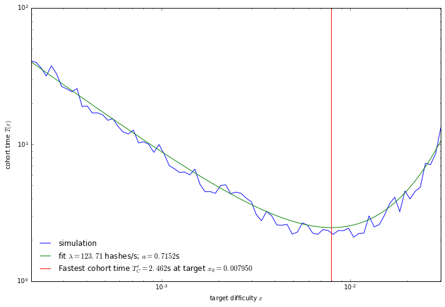

# Braid Consensus

## TODO
1. Analyze asymptotic behavior of `cohorts()`
2. Analyze the SD of the EMA algorithm
3. Analyze the SD of the PID algorithm in LambertW-transformed variables
4. Estimate parameters $K_p$, $K_i$, $K_d$ for the PID algorithm (see `tests/pid_calibrate.py`)
5. Modify simulator to slew the hashrate in order to estimate $K_i$ and look for
   oscillations.
6. Write PID algorithm using 256-bit integers (see `tests/LambertW
   Fractions.ipynb` to calculate them)

Herein we describe the Braid consensus mechanism, which is a generalization of
Nakamoto consensus to a Directed Acyclic Graph (DAG).

If the math in this document isn't rendering correctly, ensure that you have the
Latin Modern fonts installed on your system.

## Braid Structure

The Braid is a DAG structure where each node (bead) may have one or more
parents. It has one additional rule ("no incest") that one cannot name an
ancestor of a parent as a parent. This eliminates sub-graphs that contain
triangles. The reason for this extra rule is that there is no additional
information conveyed by naming a higher-order ancestor as a parent. Parents of
parents (and all other ancestors) are already considered.

An example of a "thin" braid is:

[thin-braid]: thin_braid.png
<a id="thin-braid">

![Thin Braid][thin-braid]

</a>

Here time is increasing as we move right.  The "no incest" rule means that for
example, beads 8 and 9 cannot name beads 0-6 as direct parents. The colors
correspond to "cohorts" which are sub-graphs separated by graph cuts. A graph
cut is a line drawn vertically through the graph where *all* beads on the right
side of the cut have *all* beads on the left side of the cut as ancestors. The
braid tip in this example is the bead (10), which is expected be named as the
sole parent by a miner starting from this graph state.

An example of a "thick" braid is:

[thick-braid]: thick_braid.png
<a id="thick-braid">

![Thick Braid][thick-braid]

</a>

In this image we can see examples of several higher order graph cuts, for
example between cohort (17,18,19,20,21) and cohort (22,23,24,25).  The tips in
this case are the beads (38,39), both of which should be named as parents of a
miner starting from this graph state.

The highest work path is indicated by the thick arrows running through the
middle of the graph, and beads away from the highest work path have decreasing
work as you move away from the path.  The work of each bead is the *descendant*
work, with ancestor work being used as a tie-breaker. By using descendant work,
we incentivize miners to broadcast their beads quickly so that they collect
descendants.

<!--
Graph cuts can be found with high speed using a depth first search and the
[Lowest Common Ancestor](https://en.wikipedia.org/wiki/Lowest_common_ancestor)
algorithm, which can be computed in linear time.
-->

## Braid Mathematics

The production of Proof of Work shares is a Poisson process, given by the
Poisson probability mass function which gives the probability mass that $k$
beads are formed within a time $t$ assuming constant hashrate $\lambda$ and difficulty $x$:

<a name="1"></a>

$$\tag{1}
\begin{align}
P(t,k) = \frac{(t \lambda x)^k e^{-t \lambda x}}{k!}
\end{align}
$$

where the parameter $\lambda$ is the total hashrate of the network having units
[hashes/second], $t$ has units [seconds], and $x$ is unitless.

For any subgraph corresponding to a length of time $T$, we can *measure* the
number of beads $N_B$, the number of cohorts $N_C$ as well as the average time
per bead $T_B = T/N_B$ and average time per cohort $T_C = T/N_C$. Finally the
quantity $x$ is the "target difficulty" representing the maximum acceptable
value for a proof of work hash. This gives the hashrate as:

<a id="2"></a>

$$\tag{2}
\begin{align}
\lambda = \frac{N_B}{xT}
\end{align}
$$

The cohort time $T_C$ is easy to understand in the two limits $x\to0$ (high
difficulty - blockchain-like) and $x\to \infty$ (low difficulty - thick braid).
In the $x\to0$ limit, no beads have multiple parents, and each bead is a cohort.
The cohort time is then:

<a id="3"></a>

$$\tag{3}
\begin{align}
T_C|_{x\to0} = T_B = \frac{1}{\lambda x}.
\end{align}
$$

In the opposite limit, in order to form a cohort, no beads must be produced
within a time approximately $a$ such that all beads have time to propagate to
other nodes, and be named as parents for the next bead(s), creating a cohort.
Here $a$ is a global latency parameter that you can think of as the "size" of
the network, with units of [seconds].  The probability that no beads are created
within a time interval $a$ is given by

<a id="4"></a>

$$\tag{4}
\begin{align}
P(a,0) = e^{-a \lambda x}.
\end{align}
$$

On average within a window $T$ we want $a$ to be our latency parameter satisfying:

<a id="5"></a>

$$\tag{5}
\begin{align}
T P(a,0) = a.
\end{align}
$$

Rearranging this using $T=T_CN_C$ and $N_C=1$:

<a id="6"></a>

$$\tag{6}
\begin{align}
T_C|_{x\to\infty} = \frac{a}{P(a,0)} = a e^{\lambda x a}
\end{align}
$$

Taken together, an extremely precise fit for the cohort time $T_C$ in units of
the latency $a$ is given by the sum of these two contributions
(Eqs.[3](#3),[6](#6)) which is shown in the orange line in the graph below.

<a id="7"></a>

$$\tag{7}
\begin{align}
\frac{T_C}{a} = \frac{1}{a \lambda x} + e^{a\lambda x}
\end{align}
$$

We can also determine the analytic behavior of the number of beads per cohort

<a id="8"></a>

$$\tag{8}
\begin{align}
\frac{N_B}{N_C} = 1 + a \lambda x\ e^{a\lambda x}.
\end{align}
$$



The exact behavior of the graph near the minimum is a function of the exact
network topology and inter-node latencies, and one can expect there to be some
"wiggles" in this graph near the minimum.  We may solve $T_C$ for $a$ to get

<a id="9"></a>

$$\tag{9}
\begin{align}
a = \frac{T}{N_B} W\left(\frac{N_B}{N_C}-1\right)
\end{align}
$$

The location of the minimum is given by

<a id="10"></a>

$$\tag{10}
\begin{align}
\frac{\partial T_C}{\partial x}=0
\qquad
\implies
\qquad
x = x_0 = \frac{2 W\left(\frac12\right)}{a\lambda} \simeq \frac{0.7035}{a \lambda}
\end{align}
$$

where $W(z)$ is the [Lambert W
function](https://en.wikipedia.org/wiki/Lambert_W_function).  Using $a$ from
above, the factors of $\lambda$, $a$, and $T$ all cancel out, giving us:

<a id="11"></a>

$$\tag{11}
\begin{align}
1 = \frac{2 W\left(\frac12\right)}{W\left(\frac{N_B}{N_C}-1\right)}
\qquad
\implies
\qquad
\frac{N_B}{N_C} = 1 + \frac{1}{2W(\frac12)} \simeq 2.4215
\end{align}
$$

indicating that in the steady state (constant hashrate) scenario, there are on
average 2.42 beads per cohort. This result is independent of latency $a$,
hashrate $\lambda$, and observation window $T$. The minimum value of $T_C$ in
units of latency $a$ is given by

<a id="12"></a>

$$\tag{12}
\begin{align}
\frac{T_{C,min}}{a} = \frac{1}{a\lambda x_0} + e^{a\lambda x_0} =
    \frac{1}{2 W(\frac12)} + \frac{1}{4 W(\frac12)} \simeq 3.44
\end{align}
$$

This value $x_0$ or $N_B/N_C\simeq 2.42$ and corresponding $T_{C,min} \simeq
3.44 a$ represents having the most-frequent consensus points within a global
network.  Below we will use these results to create our difficulty adjustment
algorithm targeting "most-frequent consensus" in a way that is independent of
the latency $a$, hashrate $\lambda$, and averaging window $T$.

<!--
Furthermore given any $x$, we can determine how far we are from the desired
target $x_0$ and $N_B/N_C=2.42$ by making a ratio which cancels out the factors
of $a$ and $\lambda$.
<a id="12"></a>

$$\tag{12}
x_0 = x W\left(\frac12\right) W\left(\frac{N_B}{N_C}-1\right)
$$
-->

### Discussion

We present times in units of the latency $a$, because while we have attempted to
be as accurate as possible in our simulation, there are many sources of latency
not taken into account, including actual transmission speed in copper or fiber
optic cables, the topology of the global network, processing time of beads and
creating block templates, and switching latency in directing mining devices to
change their work unit. Nonetheless our results indicate that we can devise an
algorithm completely insensitive to all these sources of latency, and
furthermore completely independent of timestamps which have been a source of
manipulation on other blockchains. It will operate as fast as it possibly can,
given the (measured) latency constraints, and automatically adjust to changing
network conditions and hashrate. We anticipate that the latency from all sources
will be on the order of 100-200ms, resulting in a bead rate around 500ms,
resulting in approximately 1000 beads (shares) per bitcoin block.

The above behavior of $\left(N_B/N_C\right)(x)$ is highly nonlinear, however we
can transform it into a linear system using the Lambert W function, where

<a id="13"></a>

$$\tag{13}
\begin{align}
a \lambda x = W\left(\frac{N_B}{N_C}-1\right)
\end{align}
$$

and we treat the product $a\lambda$ as a single unknown parameter in terms of
the measured single parameter $N_B/N_C$.

Similarly we can analytically calculate the derivative instead of using a
numeric approximation. Using this we can create a difficulty adjustment
algorithm that adapts quickly and simultaneously estimates the quantity
$a\lambda$. Separating $a$ from $\lambda$ requires the use of a clock, and
timestamps. Thus we can create a difficulty adjustment algorithm that is
independent of timing measurements.

## Consensus

Given a bead with $n$ parents $\{p_i\}$, $i=1..n$, any computable quantity
$f(\{p_i\})$ can be decided simply by examining the parents $p_i$ and their
ancestors. Thus just as in Bitcoin, any state can be determined solely by
knowing the braid tips.

The majority of consensus considerations in Bitcoin are regarding acceptable
transactions. As the first version of Braidpool will not have transactions, that
leaves the target difficulty for shares as the only quantity that needs to be
decided by consensus, which we describe how to compute below.

Let us define an arbitrary quantity upon which we want to reach consensus:
```python
    def consensus_quantity(parents:dict, highest_work_path:list, work:dict):
```
This will be called on a single cohort, with the `head` of the cohort having no
parents in the `parents` dict, and the `tail` of the cohort having no children.
This function will be called with one cohort at a time, and it's expected that
the consensus quantity can be decided without reference to any other beads. It
may use any *committed* data within any beads within the cohort, and it should
use data in the `highest_work_path` in preference to data in other beads if
necessary. The dictionary `work` is also passed, and contains a mapping from
beads to their work.

For our first example, consier the target difficulty for each bead. At a cohort
boundary, the target difficulty of all beads is identical, making it unnecessary
to reference beads outside the cohort (because beads in the head of a cohort
have exactly the same parents and ancestors).

As a second example consider transactions.

Time needs to iterate over several cohorts to get
[Median Time Past (MTP)](https://github.com/bitcoin/bips/blob/master/bip-0113.mediawiki)

### Bead Timestamps

Difficulty adjustment algorithms historically have a problem with miner-attested
timestamps being placed too far in the future, and often reject blocks with
times too far in the future. A number of timing-based attacks are possible by
manipulating timestamps in this way.

Instead of relying on the miner's attested timestamps, we will instead use
*observer* timestamps. Whenever a node receives a bead, he records a timestamp
of when that bead was observed. The [committed
metadata](https://github.com/braidpool/braidpool/blob/main/docs/braidpool_spec.md#metadata-commitments)
will contain not only the miner's timestamp which indicates when he started
mining this bead, but timestamps of each bead in his parent cohort, the
parent's-parent cohort, and the parent's-parent's-parent cohort (as observed
from this bead). This gives us a minimum of three observations of the
*received* timestamp for each bead. The `median_bead_time` for a bead is then
taken to be the median of these observations. In the following all references to
bead timestamps refer to this `median_bead_time`.

Because of the necessity to have at least 3 measurements of bead time for each
bead, when computing $T_B$ and $T_C$, we exclude the three most recent ancestor
cohorts (as observed from the bead under consideration, including that bead as
the final cohort) as there aren't enough observations of their received time to
evaluate the bead time. Therefore the observation window $T$ starts 3 cohorts
back and extends backwards in time for an interval $T$.

In order to pull off any timing-based attacks, a miner would need to control on
average 2 of these 3 timestamps, which is anyway a 51% attack and the system
breaks down anyway.

We can also compute the average solve time by comparing the miner's timestamp to
this observer timestamp. This may be used in a future update of this algorithm
to detect misbehaving miners.

### Difficulty Adjustment

It is necessary to rate-limit shares. Since shares are broadcast to all nodes,
if the bead rate is too high, the communications complexity of sending all
shares with $N$ miners is $\mathcal{O}(N^2)$, which can easily be too much
bandwidth to handle.  Furthermore, if the bead rate is too high, one can
effectively never have graph cuts. This is because in order for a graph cut to
occur, the network must be quiescent for a time proportional to $a$.

When a miner starts mining, he chooses all available tips (beads with no
descendants) and names them as parents of his new bead. He then traverses the
graph going back until he has a target number of cohorts $N_{C,target}$, and
computes the number of beads $N_B$ combined in all cohorts. We will be targeting
a value of $N_B/N_C = 1 + \frac{1}{2 W(1/2)} \simeq 2.4215$ for which we can
form an integer ratio such as $17/7 \simeq 2.4286$ which are fairly close. The
value of $N_C$ essentially defines a "time" window over which we grab all beads.

We want the target number of cohorts to be as small as reasonable, so that the
algorithm adjusts quickly to changing network conditions and hashrate. The
smallest reasonable integer ratio is 17/7, meaning we want there to be 17 beads
in the last 7 cohorts combined. When the number of beads is larger than this, we
will adjust the difficulty downwards, and when the number of beads is smaller
than this, we will adjust the difficulty upwards. We can choose larger ratios
such as 46/19, 75/31, 138/57, 201/83, 247/102, 540/223, etc and they will cause
us to respond more slowly to changes in the network hashrate and latency, but
achieve lower variation in the target difficulty.

The miner then computes the target difficulty $x_0$ for his bead as follows:


The required difficulty for his bead which then given by $x_0$. This difficulty
is committed to in the [committed metadata](https://github.com/braidpool/braidpool/blob/main/docs/braidpool_spec.md#metadata-commitments) and verified to be correct
according to the DAG and parent beads by all nodes. The committed metadata also
contains a millisecond-resolution timestamp which is required to be monotonic. A
bead's timestamp must be strictly greater than that of any of its parents. This
timestamp is *different* from the timestamp in the Bitcoin block header, which
is commonly used as nonce space for mining and not accurate. All time-dependent
calculations herein use this timestamp, not the Bitcoin block header timestamp.

# CONTENT BELOW HERE IS OUTDATED

### Critical Damping

In the event of a hashrate increases or decreases, the above difficulty
adjustment will tend to oscillate around the true value of the hashrate
$\lambda_0$ with a period of $2T$. Correspondingly the target $x(t)$ that we
calculate from the above will tend to oscillate around the desired value $x_0$.
We will damp these oscillations using [critical
damping](https://en.wikipedia.org/wiki/Damping), which means that the damping
factor is $\tau = T/\pi$. The resultant hashrate returns as quickly as possible
to the true value without oscillating. The resultant target behaves as a
critically damped oscillator:

$$
    x(t) = x_0 + (x_1-x_0) e^{-\pi t/T} \cos\left(\frac{\pi t}{T}\right)
$$

where $x_0$ is the new target in the absence of damping and $x_1$ is the last
target (which is taken to be the average target of the parents to a bead).  The
factor $e^{-\pi t/T}$ will go into our difficulty adjustment algorithm, and the
$\cos\left(\frac{\pi t}{T}\right)$ term comes from the natural behavior after a
change in hashrate. The value $t$ is the expected time to the next bead.

One can imagine this behavior by starting from blockchain-like DAG within the
time window $T$. At $t=0$ there is an instantaneous decrease in hashrate,
causing beads to be produced much faster and the resultant DAG to be "thicker".
The first cohort formed after $t=0$ has multiple beads. The algorithm slightly
increases the difficulty. The second cohort formed is still pretty "thick" and
further beads have their difficulty increased slightly more. After a time $T$
corresponding to our observation window, the cohorts within $T$ are all pretty
"thick" and we now have an observation window $T$ containing all "thick"
cohorts, which causes us to overshoot the target difficulty, making the DAG
blockchain-like again. This then repeats, oscillating between a "thin" DAG" and
a "thick" DAG with a period $2T$.

### Averaging Window

The last remaining free parameter in this algorithm is the averaging window $T$.
We want this to be short enough that it responds to changes in the network
hashrate on a timescale similar to that change, and long enough to average over
those in a reasonable manner. The change in the network hashrate is just its
time derivative $\lambda^\prime(t)$ which can be measured from the network.

FIXME more details and explicit formula

### Edge Cases

#### Blockchain-like $N_C = N_B$

An edge case occurs when the number of cohorts is the same as the number of
beads. Here the DAG is blockchain-like, with no higher-order structures. As a
consequence, $W(0)=0$ and therefore $a=0$. If this was a blockchain we'd say
that within the time window it had no orphans, and we fail to get a measurement
of the network latency.  This might happen if:

1. The difficulty is too high
2. There's only one miner on the network and he's configured synchronous block
template updates for his mine.
3. All miners are geographically centralized very near to each other, giving a
relative latency between mining nodes that is much smaller than that expected of
a global network.

We know that this network is operating on planet Earth which has a fixed size,
and a fixed latency to get a message around the globe. Therefore we can
configure a reasonable minimum $a$ as follows: consider a mining network with 4
mining nodes distributed as a tetrahedron on the surface of the Earth.  This
is the largest number of nodes in which all nodes are directly connected to each
other.  The physical distance between these nodes is the arc length on the
surface of a sphere of radius corresponding to the mean radius of the earth
$r_e=6371\ {\rm km}$. This arc length is $\ell = r_e \arccos(-1/3) = 12,173\
{\rm km}$ where this angle is approximately $109.47^\circ$.  Assuming signal
propagation can happen at the speed of light (e.g. using satellites) this is a
propagation latency of $a_{\rm min} = \ell/c = 40.60\ {\rm ms}$. We will use
this as a minimum value for $a$.

This will produce a maximum share rate for the network of approximately 24.628
shares per second, corresponding to 14777 shares per bitcoin block. If Braidpool
is used as a proxy server for e.g. a hosting provider with multiple hosts in a
single location, this is the expected share rate in the absence of
customizations for that use case.

#### Thick DAG $N_C \ll N_B$

An edge case occurs when the bead rate is too high. This can effectively prevent
cohorts from forming because there's always a new bead in flight that wasn't
included as a parent in the most recently observed bead. The following bead
ties up this with the previous cohort, growing the cohort over time. This might
happen if:

1. The network difficulty is too low
2. A miner is performing an attack where he intentionally excludes known tips
3. A network split has occurred and a miner is not receiving beads from some
portion of the network

From the perspective of any single bead, it always closes a cohort and creates a
graph cut between this bead and his parent beads. When the bead rate is too high
one would observe this parent cohort growing over time.

Therefore a solution to this edge case is to artificially increase the
difficulty when we see that the cohort formed by the parents of a bead is large.
Given an "optimal" network configuration of four mining nodes placed at the
vertices of a tetrahedron on the surface of the Earth, this would produce graph
cuts in the "thickest" average case with four beads on one side of the graph
cut, and four beads on the other side of the graph cut. Therefore if the parent
cohort contains more than four beads, we are entering this edge case and need to
increase the difficulty. Let us count the number of beads in the parent cohort
$N_{PC}$. If this is greater than four, we will implement an exponential falloff
in difficulty

$$
x = 2^{-\max(0,N_{PC}-4)} x_0
$$

This doubles the difficulty (halves the target) for every bead in the parent
cohort greater than 4.

WIP Note that in the case of an extended network split, a very large cohort may be
formed when the network split is resolved. This cohort may extend beyond the
observation window $T$, and stall the network.

FIXME WIP need to decide which beads in the cohort don't get rewareded

WIP Logical maximum is Bitcoin's network difficulty, or some fraction thereof.
Fraction set by threshold where beads don't get rewarded?

### Final Difficulty Adjustment Formula

Taking into account all of the above, the difficulty adjustment formula is then
given by first computing the desired time window $T$, counting $N_B$ and $N_C$
within that window, and then computing:

$$
\begin{array}{rcll}
\bar x       &=& \displaystyle \left(\frac{1}{N_B} \sum_{i \in {\rm beads}} \frac{1}{x_i} \right)^{-1}   & {\rm average\ target} \\
\bar \lambda &=& \displaystyle \frac{N_B}{\overline x T} & {\rm average\ hashrate} \\
a                 &=& \displaystyle \max \left(a_{\rm min}, \frac{T}{N_C} W\left(\frac{N_B}{N_C}-1\right)\right) & {\rm latency\ parameter} \\
\bar x_1     &=& \displaystyle \left(\frac{1}{N_p} \displaystyle \sum_{p \in {\rm parents}} \frac{1}{x_p}\right)^{-1} & {\rm average\ parental\ target} \\
x_0               &=& \displaystyle \frac{2 W\left(\frac12\right)}{a \bar \lambda} & {\rm optimal\ target} \\
x                 &=& \left(\displaystyle x_0 + (\bar x_1 - x_0) e^{-\pi a/T}\right) 2^{-\max(0,N_{PC}-4)} & {\rm damped\ target}
\end{array}
$$

where the index $i$ ranges over all beads within the time window $T$, and the
index $p$ ranges over parents to this bead.

FIXME is $a$ correct in the last formula? Should be median solve time.

#### Difficulty Discussion

Each bead has a different difficulty which is independently computable by all
nodes, and when a share is broadcast, this is verified as a consensus
requirement for the share to be valid.

This algorithm automatically adjusts without any further coordination. If the
bead rate is low and the DAG is blockchain-like, it increases the target (lowers
the difficulty) which increases the bead rate. Likewise if the bead rate is
high, it decreases the target (raises the difficulty) which lowers the bead
rate. It does this without oscillating due to critical damping.

The only thing left to be decided now are edge cases where there are no cohorts
containing more than one bead, or where a cohort has not been formed in a long
time, or where there are no beads at all (because the system just started).

### Consensus on Other Quantities

For other information that may be contained within beads about which we wish to
reach consensus we require that:

* Children must not have information that conflicts with their parents.
* Beads which are not ancestors of one another *may* contain conflicting
  information (for instance, a double-spend).

Consensus points occur at graph cuts (cohort boundaries).  Because of the above
rules, it is only necessary to decide between conflicting information *within* a
cohort. For example, in the [thin braid](#thin-braid) example, beads (8) and (9)
can contain conflicting information, the resolution of which is decided by a
"merge" rule in the parent bead that ties them together. In Nakamoto consensus
this "merge" rule is work weighting where work $w=1/x$ in terms of the target
difficulty $x$.  In the event that (8) and (9) have exactly the same work, the
bead with the smaller hash is chosen. (a.k.a. "luck") In the event that the
cohort is more complex, descendant work must be taken into account. This is
given by a simple sum of descendant work for bead $i$:

$$
w_i = \frac{1}{x_i} + \sum_{d \in {\rm descendants}} \frac{1}{x_d}
$$

where the bead with the larger work value is preferred to resolve conflicting
information, and the sum need only be carried out until the next cohort
boundary, since by the definition of cohorts, all additional work after the
cohort boundary is added to the work of *all* potentially conflicting beads and
does not affect conflict resolution, and DAGs don't fork.

### Rewards

We would like to reward all beads regardless of graph structure: equal pay for
equal (proof-of) work, however there's a limit on the latency we can accept. A
very high latency bead is less likely to contribute to Bitcoin's proof of work
and would create orphans, which do not increase the revenue of the pool.
Parallel work does not contribute to the total proof of work. At the same time
we do not want to create incentives on latency that are so strong that they
encourage geographic centralization or latency and connectivity games as
[occurred with P2Pool](https://bitcointalk.org/index.php?topic=153232.0).

Practically this means that if we have a very large cohort, we must decide which
beads within that cohort receive rewards and which don't. Large cohorts can be
created by miners with very high latency, network splits, or intentional selfish
mining attacks.

FIXME To solve this we will compute the work of each bead *within* a cohort
using the simple sum of descendant work formula above.

FIXME this penalizes the last bead in the cohort and enhances the first bead in
a cohort. I think I need to measure latency here and sort by latency.

## Byzantine Broadcast

FIXME Discuss Radpool proposal and it's total lack of rate-limiting.

[equation link test](#1)
